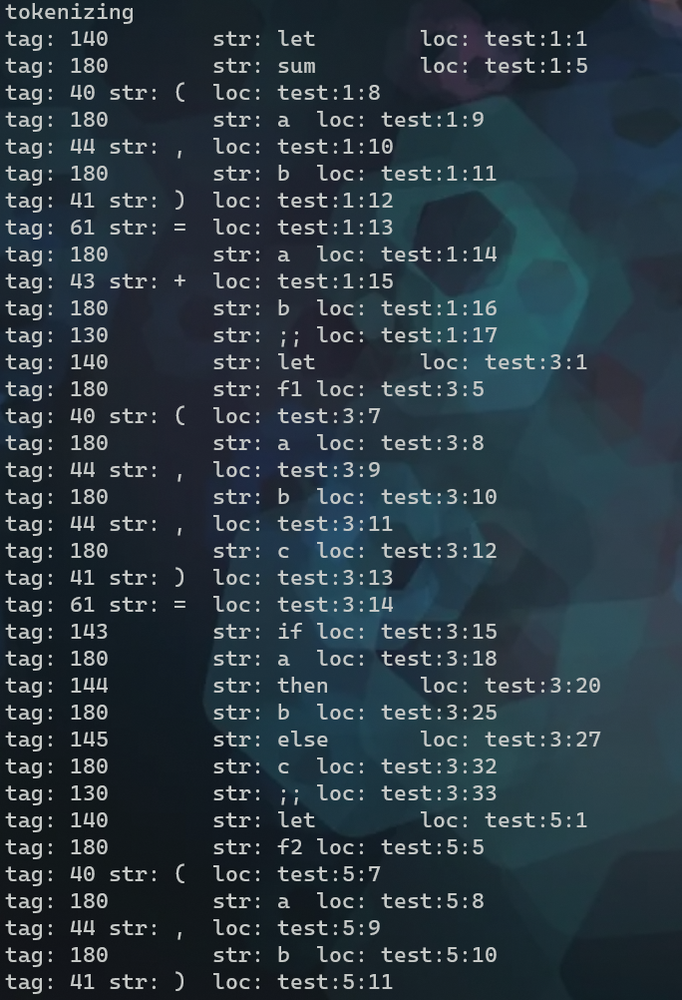
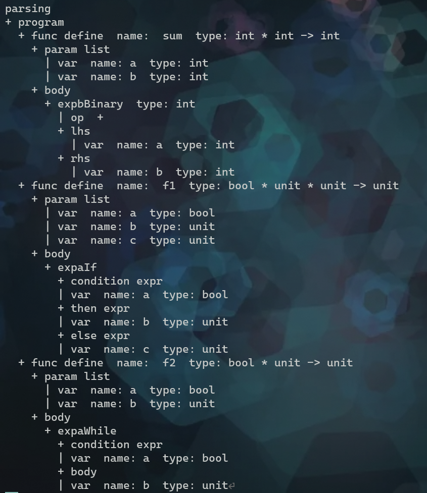
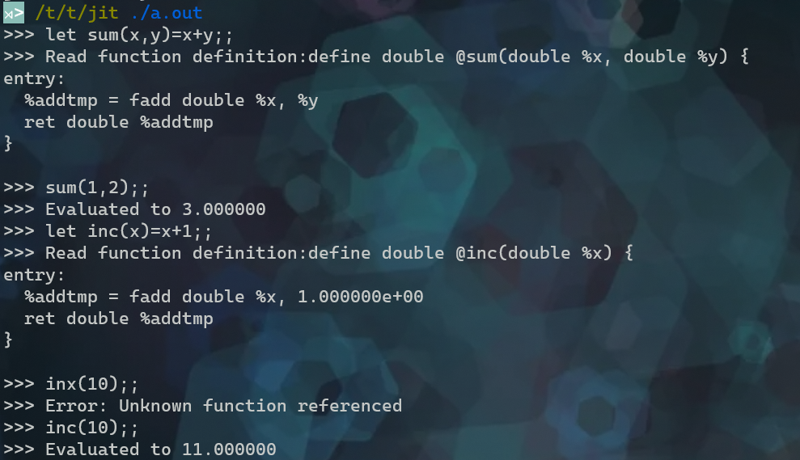
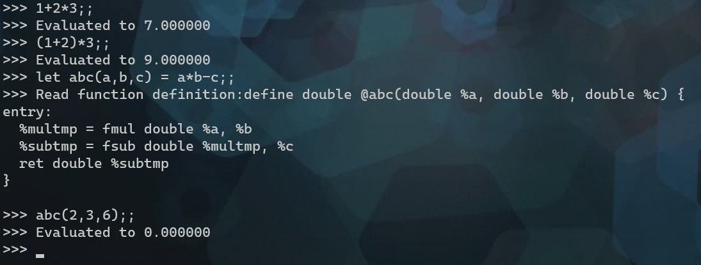

# leoml

## Intro

StLeoX's OCaml-syntax-like language compiler. Only Parser, TypeCheker currently.

BackEnd: An Interpreter, combined with llvm JIT framework.

#### Platform

> Ubuntu 20.04  
> clang 11.0.0  
> llvm 11.0.0

## Usage

``````leoml
leoml [-h|--help]
      [-l|--lexer]
      [-p|--parser]
      [-o <filename>]
      <filename>
``````

If no output file, then print to the stdout.

## Design

### Grammer

> - No type lint.
> - No ref.
> - No Object syntax.
> - Builtin data struct: pair.


> Keywords:
>
> let, and, in
>
> if, then, else
>
> while, do, done
>
> true, false
>
> fst, snd
>
> rec
>
> > Todo:
> >
> > fun
> >
> > match, with
> >
> > for,to, do, done

```
program ::= stmtlist eof

# stmt
stmtlist ::= stmt
           | stmtlist stmt

varlist ::= var
          | varlist , var
          
stmt ::= let assignStmt;;
       | var;;

# assign
assignStmt ::= funcDecl = exp
             | var = exp

# func
funcDecl ::= [rec]? var [( varlist )]?  # varlist optional
funcCall ::= var [( expblist )]?  # varlist optional

# exp
exp ::= var expblist
      | expb

expblist ::= expb
          | expblist expb

# exp base
expb ::= expa  # Expa
       | expb * expb
       | expb / expb
       | expb + expb
       | expb - expb
       | expb < expb
       | expb <= expb
       | expb == expb
       | expb <> expb
       | expb >= expb
       | expb > expb
       | expb && expb
       | expb || expb # ExpbBinary
       | expa; expb # compound # ExpbCompound
       | ( expb, expb ) #cons # ExpbCons
       | fst ( expb, expb ) # fst
       | snd ( expb, expb ) # snd 
       | + expa 
       | - expa # ExpbUnary

# exp atom
expa ::= var
       | constant
       | if exp then exp [else exp]  # else optional
       | let assignStmt [and assignStmt]* in exp  # and optional
       | while exp do exp done
       | (exp)
       | funcCall

# constant(literal)
constant ::= intl
           | floatl
           | booll
           | stringl
           | ()

intl ::= [0-9]+
floatl ::= [0-9]+.[0-9]+
booll ::= true | false
stringl ::= ".*"

var ::= [a-zA-Z][a-zA-Z_0-9]*
comment ::= (* ... *)

```

### Precedence

```
Highest --> Lowest:

1. ( )  left associative

2. * / left associative

3. + - left associative

4. < <= == <> >= > left associative

5. && left associative

6. || left associative

7. if-then-else; while-do-done

8. ; left associative

```

## Feature

#### Lexer

- Support using the '\\' to start a `newline` if you didn't finish current line yet.

- Only digit and float are supported. (No 0x, 0b, 0o numbers).
- No distinct between character and string. (Only string supported, like JS).

- No Pointer! No Pointer! No Pointer! (Everything is a reference?)

#### Parser

- No parsing error recover. So if you want to test something, you'd better input one case each time.

#### Type System

- Simple data type supported, like int, float, bool, unit, function.

- `Pair` Type ( dual-element list) supported, that means supporting:
    - construction: ( expb, epxb )
    - first element access: fst ( expb, expb )
    - second elemant access: snd ( expb, expb )

- Not supporting mutable data structure , that means no `refs`, no `arrays`.

## Reflection

1. 其实这个KwTrie冗余，因为已经存在KwMap。这个KwTrie唯一的作用可能是求First，但同样可以使用KwMap完成。

2. 为什么相应的类都需要New函数？因为调用构造函数生成在stack上，而调用New通过new生成在heap上，避免爆栈。

3. 注意区分decl里面的let 和 expa里面的let...in...，两者仅仅是复用关键字let。

4. 从Lexer的角度来看，所谓的Keywords不就是一种特殊的Ident么。

5. 可以看到文法中的decllist、varlist、expblist都是左递归的形式，但我们是有办法处理的，可以使用外部变量而不仅仅是一个栈。

6. ASTNode当中可能的_root字段被用来记录continuation的start位置（主要是利用到token->loc），而可能的\_op字段才是用来记录ASTNode的唯一类型，所以两者并不对应。

7. 建立的TokenSequence实体来表示符号栈，实际上这**并不是理论上纯粹的栈**，这个栈可以看到PeekNext从而帮助判断，这个栈甚至是支持“倒带”看到PeekPrior（）。所以Parser也不是纯粹的LR(1)
   Parser，而是部分具备LR(2)的特征。

8. 实际上，在做operator<<的部分，也是同样地在写`Producer Pattern`。

9. 你会发现，在Parser里面使用最多的函数就是Next()，也就是所谓`eat`逻辑。

10. 一个比较遗憾的地方是，我很喜欢`cons` kw，但在OCaml里面不需要cons就能直接构造`Piar` : (epxa, expb)。所以最后还是没支持cons kw。

11. 一个非常坑的地方：二元运算符'+'和一元运算符'+'可以混用吗？尤其是如何区分： exp = var <u>+expa</u>  和 exp = <u>var+expa</u>，两者从ts来看完全一致，如果不区分二元运算符'+'
    和一元运算符'+'的话。

12. `func`应该从`decl`中独立出来，从而达成复用。且无参函数不应该携带括号以接收参数，因为Token`()`已经被识别为Token::Unit。

13. Scope现在只做到了program级别。另外let...in...可以做Scope，就是let parentScope in childScope。

14. 处理Scope和TypeCheck的时候，牢记`属性文法框架`，以及递推的基本形式。

15. **从最基本的组织架构原则来看，在Enhance Parser时，ScopeCheck和TypeCheck应当是作为AfterHook，AOP到Parse的尾部。**

### Schedule

#### ToDo

1.Eval: An evaluater to eval the Expr, through visiting the tree from bottom.

2.CodeGen: Combine the llvm JIT Framework.

#### Passed

1.Parser passed.

2.TypeChecker passed.

## FAQs

#### 1.How to build the project?

First, make sure `cmake` & `make` installed.  
For full parser target, do this:
> cd src  
> cmake .  
> make leoml

For JIT target, do this:
> cd src/jit  
> make leoml

#### 2.How to conduct verification?

**Note: auto tester for parser is ready.  
As for jit REPL, you should input manually.**

First, you should install the Python3 environment.

Then, in CLI input this to run the automated tester. Notice that you should have set the exe path before, like "
../src/cmake-build-debug/leoml.exe".

> cd test && python3 ./test/tester.py

Finally, the tester will display the test report.

#### 3.How to contribute?

Emm...free for you to modify the source code.

## Demos & Snapshots

Given leoml source like:

```
let sum(a,b)=a+b;;

let f1(a,b,c)=if a then b else c;;

let f2(a,b)=while a do b done;;
```

After tokenizing:  


After parsing:  


Interaction with REPL:  


